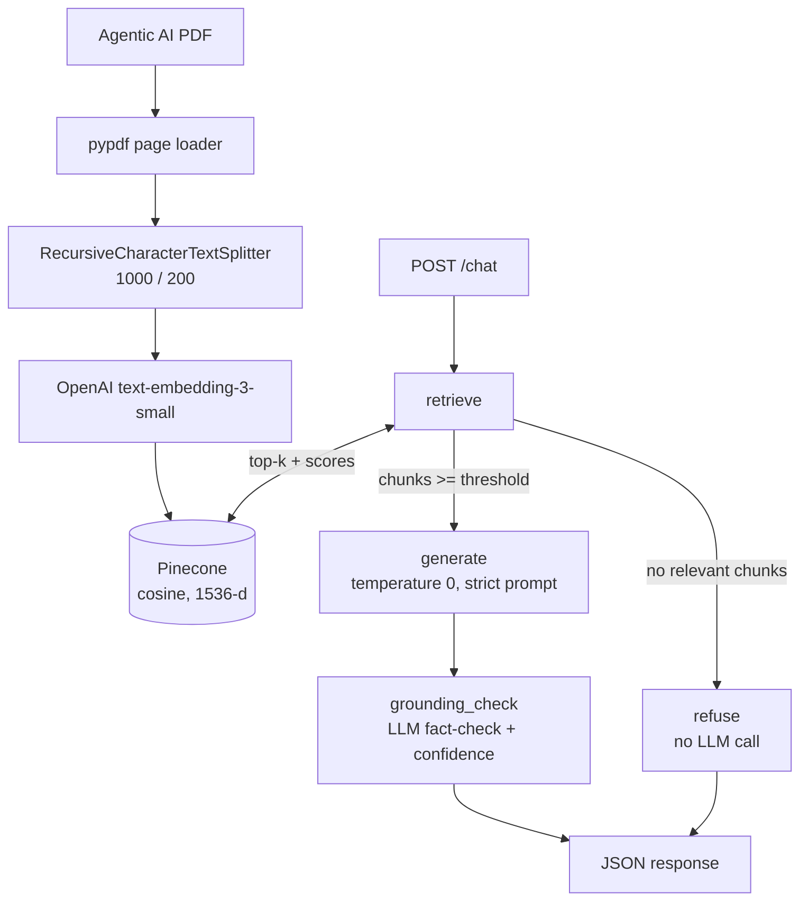

# Agentic AI RAG Chatbot

A Retrieval-Augmented Generation chatbot that answers questions **strictly** from the
[Agentic AI eBook](https://konverge.ai/pdf/Ebook-Agentic-AI.pdf). Built with Python, LangGraph,
Pinecone, OpenAI and FastAPI. Anything the PDF does not support (e.g. *"What is the capital of France?"*)
is refused with a low confidence score instead of answered from the LLM's general knowledge.

## Architecture



LangGraph flow: `START → retrieve → (generate → grounding_check | refuse) → END`

## Tech stack

| Tech | Why |
|---|---|
| Python 3.10+ | language |
| LangGraph | explicit, inspectable graph with a conditional branch (refuse vs. generate) |
| Pinecone (serverless) | managed vector DB, cosine similarity, metadata storage |
| OpenAI `text-embedding-3-small` | 1536-d embeddings, cheap and strong |
| OpenAI chat model (`gpt-4o-mini` default, override with `OPENAI_CHAT_MODEL`) | generation + grounding judge |
| pypdf + `langchain-text-splitters` | page-level parsing, recursive chunking |
| FastAPI + Pydantic | typed API, validation, auto docs at `/docs` |
| python-dotenv | loads secrets from `.env` |

## Project structure

```
rag-agentic-ai/
├── data/Ebook-Agentic-AI.pdf   # downloaded automatically by ingestion (git-ignored content optional)
├── src/
│   ├── __init__.py             # makes `src` a package
│   ├── config.py               # env loading + validation, all tunables (top_k, threshold, models)
│   ├── ingestion.py            # PDF -> pages -> chunks -> embeddings -> Pinecone (idempotent)
│   ├── graph.py                # LangGraph state, nodes, routing, confidence calculation
│   └── prompts.py              # generation prompt, judge prompt, refusal string
├── scripts/run_benchmark.py    # runs the 6 benchmark queries and prints answer/confidence/chunks
├── tests/test_rag.py           # offline unit tests + key-gated integration tests
├── docs/INTERVIEW_PREP.md      # interview explanations and Q&A
├── app.py                      # FastAPI app: POST /chat, GET /health
├── requirements.txt
├── pytest.ini                  # registers the `integration` marker
├── .env.example                # placeholders only
├── .gitignore                  # ignores .env, venv, caches
└── README.md
```

## Installation

```bash
git clone https://github.com/<your-username>/rag-agentic-ai.git
cd rag-agentic-ai
python -m venv venv

# Windows (PowerShell)
venv\Scripts\Activate.ps1
# Windows (cmd)
venv\Scripts\activate.bat
# Linux / macOS
source venv/bin/activate

pip install -r requirements.txt
```

## Environment variables

```bash
cp .env.example .env      # Windows: copy .env.example .env
```

| Variable | Required | Meaning |
|---|---|---|
| `OPENAI_API_KEY` | yes | OpenAI key |
| `PINECONE_API_KEY` | yes | Pinecone key |
| `PINECONE_INDEX_NAME` | yes | index name (default suggestion `agentic-ai-index`) |
| `OPENAI_CHAT_MODEL` | no | default `gpt-4o-mini` |
| `TOP_K` | no | default `3` |
| `RELEVANCE_THRESHOLD` | no | cosine cut-off, default `0.30` |
| `PINECONE_CLOUD` / `PINECONE_REGION` | no | default `aws` / `us-east-1` |

Missing required variables raise a clear `ConfigError` at first use. `.env` is git-ignored.

## Pinecone setup

Nothing to do manually: ingestion creates a **serverless, cosine, 1536-dimension** index named
`PINECONE_INDEX_NAME` if it does not exist, and fails loudly if an existing index has the wrong
dimension or metric. You only need a Pinecone account and API key.

## Ingestion

```bash
python -m src.ingestion            # use -m from the project root
python -m src.ingestion --reset    # optional: wipe the index first (e.g. after changing chunking)
```

Idempotent: each chunk ID is a hash of `source|page|chunk_index|text`; re-running upserts the same IDs and
skips embedding for chunks already stored. Metadata stored per vector: `source`, `page`, `chunk_index`, `text`.

## Run the API

```bash
uvicorn app:app --reload
```
Interactive docs: http://127.0.0.1:8000/docs

## API usage

```bash
curl -X POST http://127.0.0.1:8000/chat \
  -H "Content-Type: application/json" \
  -d '{"query": "What is Agentic AI?"}'

curl http://127.0.0.1:8000/health
```

### Response shape

```json
{
  "query": "What is Agentic AI?",
  "final_answer": "<answer generated from the retrieved chunks>",
  "retrieved_context_chunks": ["<chunk text 1>", "<chunk text 2>"],
  "confidence_score": 0.0
}
```
Values above are placeholders: real answers, chunks and scores depend on your ingested PDF and are not
reproduced here because they must come from an actual run. Out-of-scope example:

```json
{
  "query": "What is the capital of France?",
  "final_answer": "I cannot answer based on the provided document.",
  "retrieved_context_chunks": [],
  "confidence_score": 0.0
}
```
Errors: `422` invalid/blank query, `500` missing configuration, `502` OpenAI/Pinecone failure.

## Testing

```bash
pytest -v -m "not integration"     # offline unit tests, no keys needed
pytest -v -m integration -s        # needs .env keys + `python -m src.ingestion` done first
python -m scripts.run_benchmark    # prints Query / Answer / Confidence / Retrieved chunks for all 6 queries
```

**Status:** the 10 offline unit tests were executed and pass. The integration tests and the benchmark
script require real OpenAI/Pinecone keys and were **not** executed by the author of this code; their
expected behaviour is: questions 1-5 return a non-refusal answer with `confidence_score > 0` and at least one
chunk; question 6 returns the refusal message with confidence `<= 0.2`.

## Grounding strategy

1. **Relevance threshold** - only Pinecone matches with cosine score >= `RELEVANCE_THRESHOLD` (default 0.30) are kept.
2. **Retrieved context only** - the prompt receives just those chunks, delimited in `<context>` tags, with page/source labels.
3. **Strict prompt** - answer only from context, else reply `I cannot answer based on the provided document.`; temperature 0.
4. **Refusal short-circuit** - if no chunk passes the threshold, the `refuse` node responds without calling the LLM, so a question like "capital of France" cannot be answered from model knowledge.
5. **Grounding check** - a second, structured LLM call labels the answer `fully_supported`, `partially_supported` or `not_supported` against the context. `not_supported` answers are replaced by the refusal message.
6. **Refusal behaviour** - any refusal (no context, model refusal, unsupported answer) gives `confidence_score = 0.0`, `grounded = false`.

### Confidence calculation

```
confidence = 0.4 * retrieval_relevance + 0.6 * answer_support
retrieval_relevance = clamp((mean_cosine_of_used_chunks - threshold) / (0.75 - threshold), 0, 1)
answer_support      = 1.0 (fully) | 0.5 (partially) | 0.0 (not supported / refusal)
```
It is a hand-tuned **heuristic**, not a calibrated probability or a guarantee. The 0.4/0.6 weights, the 0.75
ceiling and the 0.30 threshold are starting points that should be tuned on a labelled question set.

## Limitations

- Threshold and weights are not empirically calibrated; a bad threshold can wrongly refuse or admit questions.
- The LLM judge can itself be wrong, and adds cost and latency (2 LLM calls per answered question).
- Text-only PDF extraction: tables, images and charts are lost; scanned pages would need OCR.
- No conversation memory: every request is independent. Vague follow-ups ("and the second one?") fail.
- Pure dense retrieval can miss exact-keyword matches.
- Answers name no inline citations; page numbers exist in state but the API returns chunk text only.

## Future improvements

Reranking (cross-encoder), hybrid search (BM25 + dense), a labelled evaluation set (RAGAS-style metrics),
observability (LangSmith/OpenTelemetry), response caching, conversation memory, citation-level answers with
page numbers, streaming responses, auth and rate limiting.
